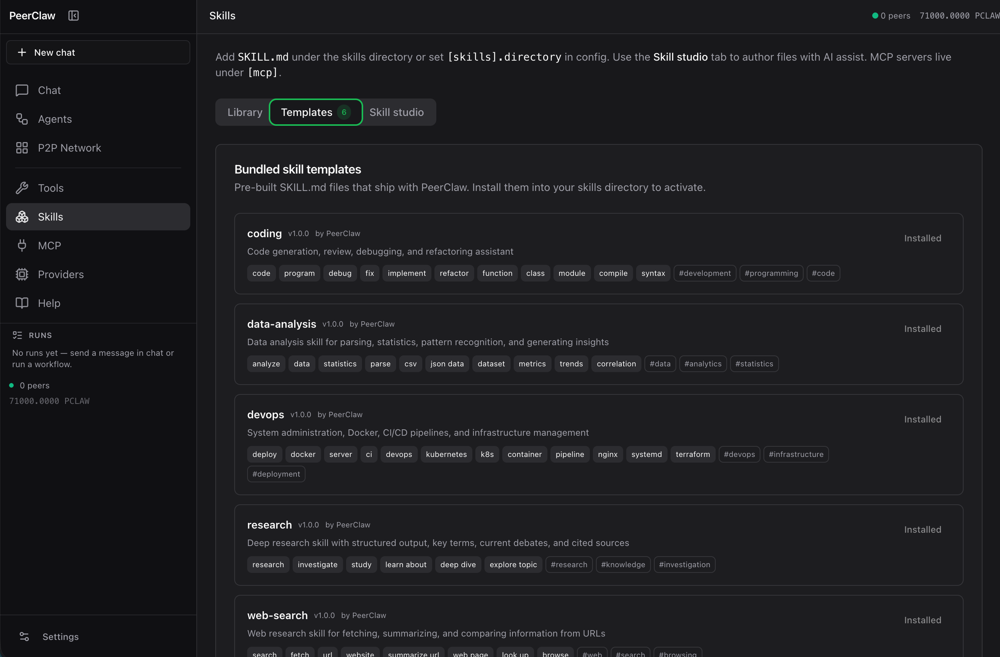

<p align="center">
  
</p>

<h1 align="center">PeerClaw</h1>

<p align="center"><strong>Decentralized P2P AI Agent Network</strong></p>

<p align="center">
  <em>One binary. Distributed intelligence. Token-powered autonomy.</em>
</p>

<p align="center">
  
  
  
</p>

---

## Overview

PeerClaw is a peer-to-peer network where AI agents collaborate, share compute resources, and transact using a native token economy. Think **BitTorrent meets AI inference** — every peer contributes compute and earns tokens, while agents spend tokens to execute tasks across the network.

**Ships as a single static binary.** No containers, no orchestrators, no cloud dependencies.

---

## Key Features

- **Local AI inference** — Run GGUF models (Llama, Phi, Qwen, Gemma) with Metal/CUDA acceleration, streaming, and batch aggregation
- **P2P networking** — Decentralized peer discovery via libp2p (Kademlia, GossipSub, mDNS, Noise encryption)
- **Agent runtime** — ReAct loop with tool calling, budget enforcement, and TOML-defined agent specs
- **Token economy** — PCLAW token accounting, escrow, and budget limits (per-request/hour/day/total)
- **Multi-agent orchestration** — Visual workflow builder, multi-step pipelines, P2P workflow market
- **Vector memory** — Semantic search (HNSW + BM25 hybrid) with cross-session learning
- **Tools & MCP** — 20+ builtin tools, WASM sandbox, and Model Context Protocol integration
- **LLM provider sharing** — Share your Ollama/GGUF models over P2P and earn CLAW tokens
- **Web dashboard** — Agentic chat, workflow builder, network topology, task management
- **Safety layer** — Leak detection, prompt injection defense, content policy enforcement
- **OpenAI-compatible API** — Drop-in replacement with SSE streaming

---

## Supported Backends

### Inference

| Backend | Status | Notes |
|---------|--------|-------|
| **Local GGUF** | ✅ | Direct model loading via llama-cpp-2 |
| **Ollama** | ✅ | Automatic model management and GPU acceleration |
| **Remote API** | ✅ | OpenAI, Anthropic, Groq, Together, OpenRouter, or any compatible endpoint |
| **P2P Providers** | ✅ | Use LLMs from other peers on the network (costs CLAW tokens) |

### Messaging Channels

| Platform | Status | Notes |
|----------|--------|-------|
| **REPL** | ✅ | CLI stdin/stdout interaction |
| **WebSocket** | ✅ | Used by the web dashboard chat |
| **Webhook** | ✅ | HTTP POST endpoint, configurable port |
| **Telegram** | ✅ | Native Bot API integration (long polling) |

---

## Screenshots

### Chat — Agentic assistant with tool calling

<p align="center">
  
</p>

### Agent Builder — Visual workflow editor

<p align="center">
  
</p>

### Setup Wizard — Model downloads and configuration

<p align="center">
  
</p>

### Tools — Browse, inspect, and execute

<p align="center">
  
</p>

### P2P Network — Peer topology & connections

<p align="center">
  
</p>

### Settings — Inference backends

<p align="center">
  
</p>

### Skills — Template library

<p align="center">
  
</p>

---

## Quick Start

### Docker (recommended)

```bash
git clone https://github.com/antonellof/peerclaw.git
cd peerclaw
docker compose up --build
# Open http://localhost:8080 — the setup wizard guides you through configuration
```

Make sure [Ollama](https://ollama.com) is running on your host (`ollama serve`).

### Build from source

```bash
git clone https://github.com/antonellof/peerclaw.git
cd peerclaw
cargo build --release
```

### Download a model

```bash
mkdir -p ~/.peerclaw/models
curl -L -o ~/.peerclaw/models/llama-3.2-1b-instruct-q4_k_m.gguf \
  "https://huggingface.co/bartowski/Llama-3.2-1B-Instruct-GGUF/resolve/main/Llama-3.2-1B-Instruct-Q4_K_M.gguf"
```

### Run

```bash
# Interactive chat (Ollama-style)
peerclaw run llama-3.2-1b

# Full-featured chat with slash commands
peerclaw chat

# Start peer node with web dashboard
peerclaw serve --web 127.0.0.1:8080

# With Ollama + personal assistant agent
peerclaw serve --web 127.0.0.1:8080 --ollama --agent templates/agents/assistant.toml

# Share your LLM with the network (earn CLAW tokens)
peerclaw serve --web 127.0.0.1:8080 --ollama --share-inference
```

---

## Web Dashboard

The dashboard ships with the binary and is served via `--web`.

| Feature | Description |
|---------|-------------|
| **Agentic chat** | ReAct loop with tool calling, MCP support, session history |
| **Workflow builder** | Visual node editor for multi-step agent pipelines |
| **Agent library** | Browse, edit, and instantiate saved workflows |
| **Task management** | Create, monitor, and inspect agent task results with tool traces |
| **Network topology** | Interactive D3.js graph with clickable node details |
| **Provider settings** | Configure LLM sharing, view discovered network providers |
| **MCP console** | Add/edit MCP servers, inspect connection status |
| **Setup wizard** | Guided onboarding for inference, models, and MCP |

---

## Built-in Agent Templates

PeerClaw ships with multi-step agent pipelines (not just single-LLM wrappers):

| Agent | Pipeline | Description |
|-------|----------|-------------|
| **Deep Researcher** | Classify → Guardrail → Research → Synthesize | Safety check, thorough investigation, polished report |
| **Code Reviewer** | Analyze → Refactor → Format | Structured analysis, refactoring suggestions, severity levels |
| **Creative Writer** | Classify → Outline → Draft → Edit | Genre detection, outline, full draft, editor polish |
| **Data Analyst** | Understand → Analyze → Recommend | Parse request, execute analysis, actionable insights |

Select any agent in **Chat → Agents** dropdown, or build your own in the **Workflow builder**.

---

## Built-in Tools

| Tool | Description |
|------|-------------|
| `web_search` | DuckDuckGo search (no API key) |
| `web_fetch` | Fetch and extract text from web pages |
| `browser` | Headless browser automation |
| `file_read` / `file_write` / `file_list` | Filesystem operations |
| `shell` | Sandboxed shell command execution |
| `code_exec` | Python, JavaScript, Bash, Ruby in sandbox |
| `http` | HTTP requests (GET, POST, PUT, DELETE, PATCH) |
| `memory_search` / `memory_write` | Vector semantic memory (cross-session) |
| `job_submit` / `job_status` | P2P marketplace jobs (costs CLAW tokens) |
| `agent_spawn` | Spawn sub-agents with independent context |
| `llm_task` | Delegate sub-tasks to another LLM call |
| `peer_discovery` | Discover peers with specific capabilities |
| `wallet_balance` | Check CLAW token balance and transactions |
| `apply_patch` | Apply unified diffs to files |
| `pdf_read` | Extract text from PDFs |
| `json` | Parse, query, and transform JSON |
| `echo` / `time` | Utility tools |

Plus **WASM sandbox tools** and **MCP server tools** (stdio, `server:tool_name` format).

---

## Agent Specs (TOML)

Define custom agents with model, tools, budget, and capabilities:

```toml
# my-agent.toml
[agent]
name = "code-reviewer"
description = "Reviews code for bugs and best practices"

[model]
name = "llama3.2:3b"
max_tokens = 4096
temperature = 0.3
system_prompt = "You are an expert code reviewer."

[capabilities]
storage = true

[budget]
per_request = 3.0
total = 500.0

[tools]
builtin = ["file_read", "file_list", "shell"]
allowed_commands = ["grep", "wc", "find", "cat"]

[channels]
websocket = true
```

```bash
peerclaw serve --web 127.0.0.1:8080 --ollama --agent my-agent.toml
```

---

## Messaging Channels

Agents can receive and respond to messages across multiple platforms simultaneously. Configure channels in the `[channels]` section of your agent TOML, or via the dashboard under **Workspace → Channels**.

### Telegram

Native integration via the Telegram Bot API (long polling).

**1. Create a bot** — Talk to [@BotFather](https://t.me/BotFather) on Telegram and get your bot token.

**2. Set the token** — Add it to `~/.peerclaw/.env` or export it:
```bash
export TELEGRAM_BOT_TOKEN="123456:ABC-DEF1234ghIkl-zyx57W2v1u123ew11"
```

**3. Configure your agent:**
```toml
[channels]
telegram = { bot_token_env = "TELEGRAM_BOT_TOKEN" }
```

**4. Run:**
```bash
peerclaw serve --ollama --agent templates/agents/telegram-bot.toml
```

The bot will poll for messages and respond using your local LLM. See `templates/agents/telegram-bot.toml` for a complete example.

### Webhook

HTTP endpoint that receives POST requests and responds with the agent's reply.

```toml
[channels]
webhook = true                  # Default port
webhook = { port = 8090 }      # Custom port
```

Send messages to the webhook:
```bash
curl -X POST http://localhost:8090/webhook \
  -H "Content-Type: application/json" \
  -d '{"message": "Hello!", "user_id": "u1", "conversation_id": "conv1"}'
```

**Tip:** Discord and Slack both support outgoing webhooks — you can connect them to PeerClaw's webhook channel without any adapter.

### WebSocket

Used by the web dashboard chat. Enable it to allow real-time browser-based interaction:

```toml
[channels]
websocket = true
```

### REPL

CLI stdin/stdout interaction. Useful for local testing:

```toml
[channels]
repl = true
```

### Multiple channels

An agent can listen on several channels at once:

```toml
[channels]
repl = true
websocket = true
webhook = { port = 8090 }
telegram = { bot_token_env = "TELEGRAM_BOT_TOKEN" }
```

### Dashboard configuration

You can also add channels at runtime from the web dashboard (**Workspace → Channels**) without editing TOML files. The dashboard supports Telegram (bot token), webhooks, and WebSocket.

---

## Commands

### Chat & Inference

```bash
peerclaw run <model>              # Interactive chat
peerclaw run <model> "prompt"     # Single query
peerclaw chat                     # Chat with slash commands (/help, /model, /tools, /status)
```

### Models

```bash
peerclaw models list              # List downloaded models
peerclaw models download <model>  # Download from HuggingFace
peerclaw pull <model>             # Alias for download
```

### Network

```bash
peerclaw serve                                # Start peer node
peerclaw serve --web 0.0.0.0:8080             # With web dashboard
peerclaw serve --ollama --share-inference     # Share LLM with network
peerclaw serve --ollama --agent agent.toml    # With agent runtime
peerclaw network status                       # Network health
peerclaw peers list                           # Connected peers
```

### Vector Memory

```bash
peerclaw vector create <collection>              # Create collection
peerclaw vector insert <collection> <text>       # Insert with auto-embedding
peerclaw vector search <collection> <query> -k 5 # Semantic search
```

### Skills, Tools, Wallet, Jobs

```bash
peerclaw skill list | install | search        # Skill management
peerclaw tool list | info | build             # Tool management
peerclaw wallet balance | send | history      # Token wallet
peerclaw job submit | status | list           # Job marketplace
peerclaw doctor                               # Run diagnostics
```

---

## API

### OpenAI-Compatible

```bash
peerclaw serve --web 127.0.0.1:8080
```

```python
from openai import OpenAI

client = OpenAI(base_url="http://localhost:8080/v1", api_key="unused")
response = client.chat.completions.create(
    model="llama-3.2-3b",
    messages=[{"role": "user", "content": "Hello!"}],
    stream=True
)
for chunk in response:
    print(chunk.choices[0].delta.content, end="")
```

### Workflow API

| Method | Path | Purpose |
|--------|------|---------|
| `POST` | `/api/workflows/validate` | Validate a workflow spec |
| `POST` | `/api/workflows/kickoff` | Start a workflow run |
| `GET` | `/api/workflows/runs` | List workflow runs |
| `GET` | `/api/workflows/runs/:id` | Run status and output |
| `GET` | `/api/workflows/runs/:id/stream` | SSE progress stream |
| `POST` | `/api/workflows/runs/:id/stop` | Cancel a run |

Legacy aliases: `/api/crews/*` and `/api/flows/*`.

### A2A Integration

| Endpoint | Purpose |
|----------|---------|
| `GET /.well-known/agent-card.json` | Agent capabilities card |
| `POST /a2a` | JSON-RPC task interface |
| `GET /a2a/peers` | Discovered agent cards from the mesh |

### Python SDK

```bash
cd sdk/python && pip install -e ".[dev]"
export PEERCLAW_BASE_URL=http://127.0.0.1:8080
python examples/minimal.py
```

---

## Architecture

```
peerclaw/
├── src/
│   ├── node.rs              # Orchestrates all subsystems
│   ├── agent/               # Agent runtime (ReAct loop, budget, tool execution)
│   ├── p2p/                 # libp2p networking (Kademlia, GossipSub, mDNS)
│   ├── inference/           # GGUF model loading, Ollama, remote API
│   ├── vector/              # vectX semantic search (HNSW, BM25, hybrid)
│   ├── job/                 # Request/bid/execute/settle workflow
│   ├── wallet/              # PCLAW token accounting, escrow
│   ├── tools/               # Builtin tools, WASM sandbox
│   ├── skills/              # SKILL.md prompt extensions
│   ├── safety/              # Leak detection, injection defense
│   ├── mcp/                 # Model Context Protocol client
│   ├── web/                 # Dashboard, OpenAI API, workflow API
│   └── messaging/           # Multi-platform channels
├── prompts/                 # Prompt templates (overridable at runtime)
├── templates/               # Agent, workflow, and skill templates
├── web/                     # React + Vite + shadcn dashboard
├── sdk/python/              # Python SDK
└── ironclaw/                # External tools and channel adapters
```

### Key Dependencies

| Subsystem | Crate |
|-----------|-------|
| Async Runtime | `tokio` |
| P2P Networking | `libp2p` 0.54 |
| Vector Database | `vectx` |
| WASM Sandbox | `wasmtime` 28.x |
| HTTP/Web | `axum` 0.7 |
| Database | `redb` 2.x |
| Serialization | `serde` + `rmp-serde` |
| Crypto | `ed25519-dalek` 2.x, `blake3` |
| AI Inference | `llama-cpp-2` 0.1 |
| CLI | `clap` 4.x |

---

## Prompt Customization

Override any prompt fragment without recompiling:

```bash
mkdir -p ~/.peerclaw/prompts
cp prompts/agentic_system_intro.txt ~/.peerclaw/prompts/
# Edit, then restart the node
```

Or set via environment or config:

```bash
export PEERCLAW_PROMPTS_DIR=/etc/peerclaw/prompts
```

Resolution order: `[prompts].directory` in `config.toml` → `PEERCLAW_PROMPTS_DIR` → `~/.peerclaw/prompts`.

---

## Configuration

### Environment Variables

| Variable | Description | Default |
|----------|-------------|---------|
| `PEERCLAW_HOME` | Base directory for data | `~/.peerclaw` |
| `PEERCLAW_LOG` | Log level (trace, debug, info, warn, error) | `info` |
| `PEERCLAW_PROMPTS_DIR` | Prompt fragment override directory | *(unset)* |

### Config File

Create `~/.peerclaw/config.toml`:

```toml
[p2p]
listen_addresses = ["/ip4/0.0.0.0/tcp/0"]
bootstrap_peers = []
mdns_enabled = true

[web]
enabled = false
listen_addr = "127.0.0.1:8080"

[inference]
models_path = "~/.peerclaw/models"
default_model = "llama-3.2-3b"

[vector]
embedding_dim = 384
persistence_path = "~/.peerclaw/vector"

[safety]
leak_detection = true
injection_defense = true
policy_enforcement = true
```

---

## Development

```bash
cargo build --release              # Build
cargo test                         # Run tests
cargo clippy                       # Lint
cargo fmt                          # Format

# Web UI development (hot reload)
cd web && npm install && npm run dev

# Production web build
cd web && npm run build
```

### Testing Clusters

```bash
peerclaw test cluster --nodes 3           # Spawn test cluster
./scripts/run_agents.sh                   # 5 nodes with staggered startup
```

---

## Roadmap

### Completed

- **v0.2** — P2P networking, GGUF inference, job marketplace, token wallet, OpenAI API, web dashboard, vector memory, skills, safety, MCP
- **v0.3** — Swarm visualization, WASM sandbox, Ed25519 signatures, Rustyline CLI, diagnostics
- **v0.4** — Agent runtime (ReAct), LLM provider sharing, remote execution, tasks/providers dashboard, budget enforcement, crew orchestration, flows, A2A HTTP, Python SDK
- **v0.5** — Unified workflows, visual builder, agent library, multi-step templates, real-time WebSocket streaming, prompt customization

### In Progress

- [ ] Distributed inference (pipeline/tensor parallelism across peers)
- [ ] Multi-agent hardening (production QA, load tests, CI fixtures)
- [ ] Durable agent runs (checkpoint, resume, audit export)
- [ ] Observability (structured traces, OTLP export)
- [ ] Cross-peer tool execution with reputation signals
- [ ] Human-in-the-loop (policy-gated pause/approve for high-risk actions)
- [ ] Context compaction (LLM summarization for long sessions)

### Future (v1.0)

- [ ] On-chain settlement
- [ ] Public tool registry
- [ ] Governance
- [ ] Firecracker microVM isolation

---

## Security

- **WASM sandbox** — Wasmtime with explicit capability grants
- **Noise protocol** — End-to-end encryption for all P2P traffic
- **Ed25519 signatures** — Cryptographic identity on all messages
- **Capability-based access** — Explicit permission grants for tools and channels
- **Safety layer** — Credential leak detection, prompt injection defense, content policy

---

## License

PeerClaw is dual-licensed under:

- **MIT License** ([LICENSE-MIT](LICENSE-MIT))
- **Apache License 2.0** ([LICENSE-APACHE](LICENSE-APACHE))

---

*Cargo version: **0.3.0** — README reflects the in-tree feature set through v0.5.*
