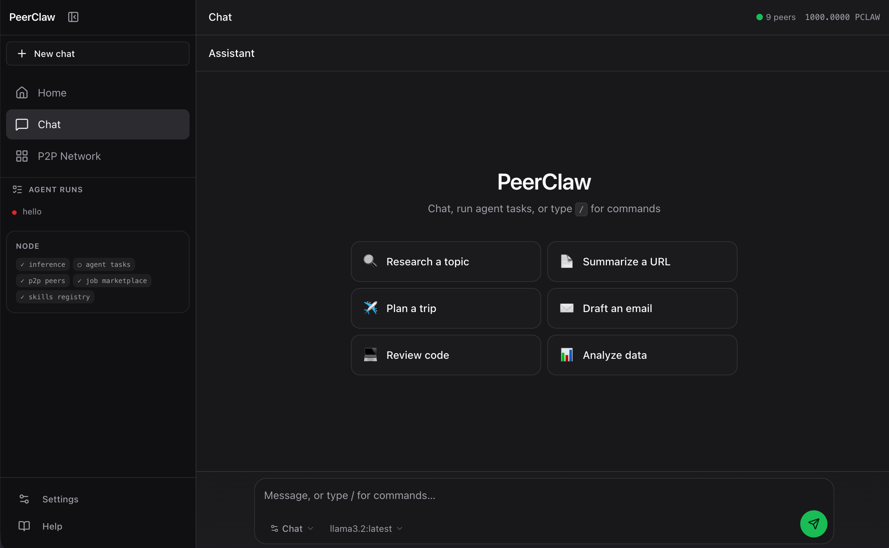
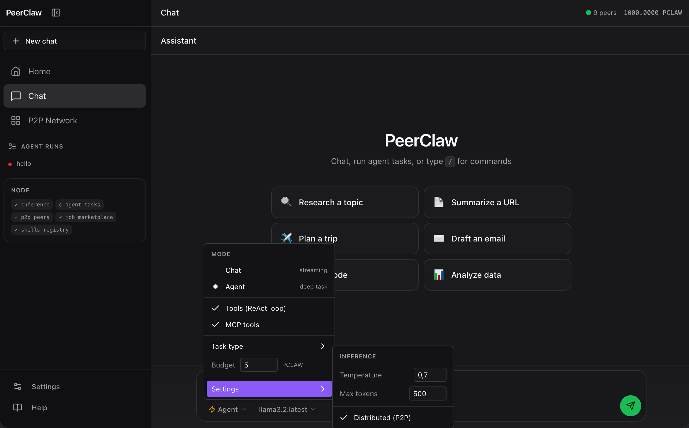
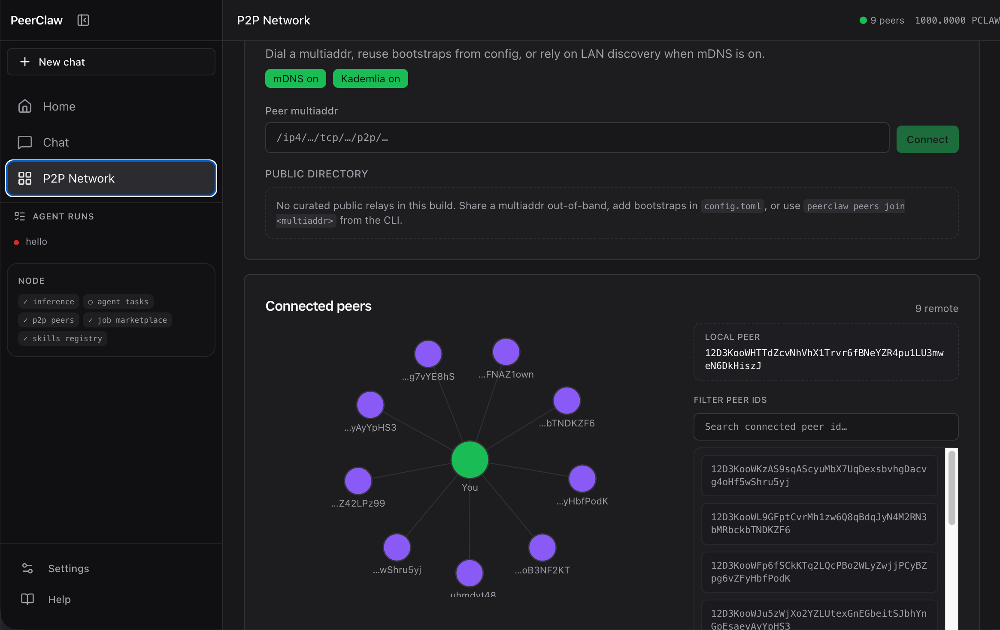
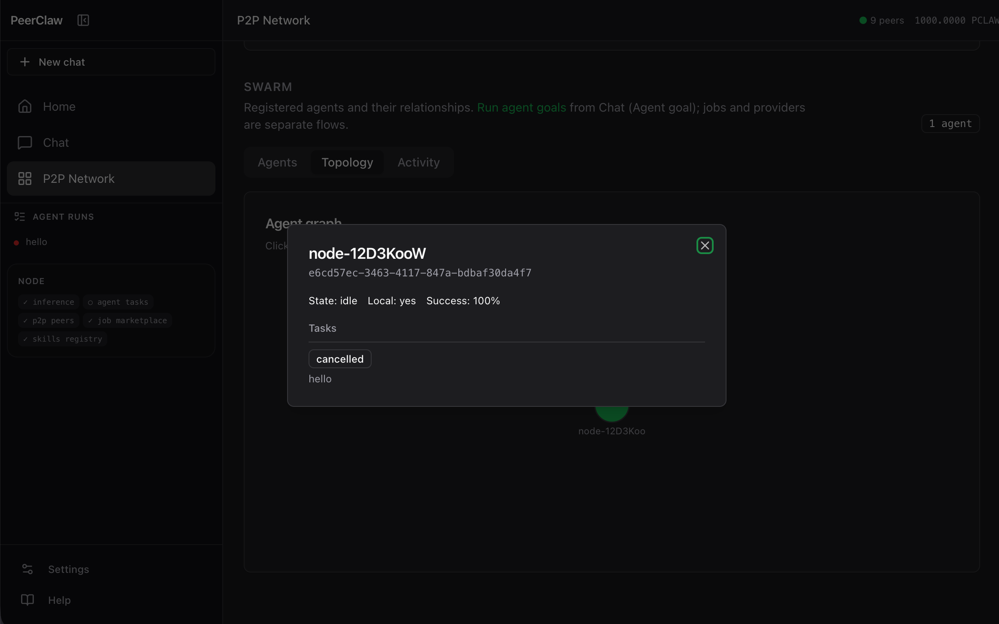
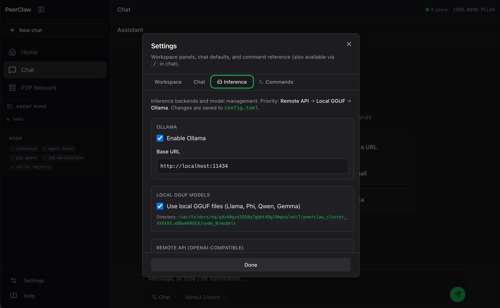
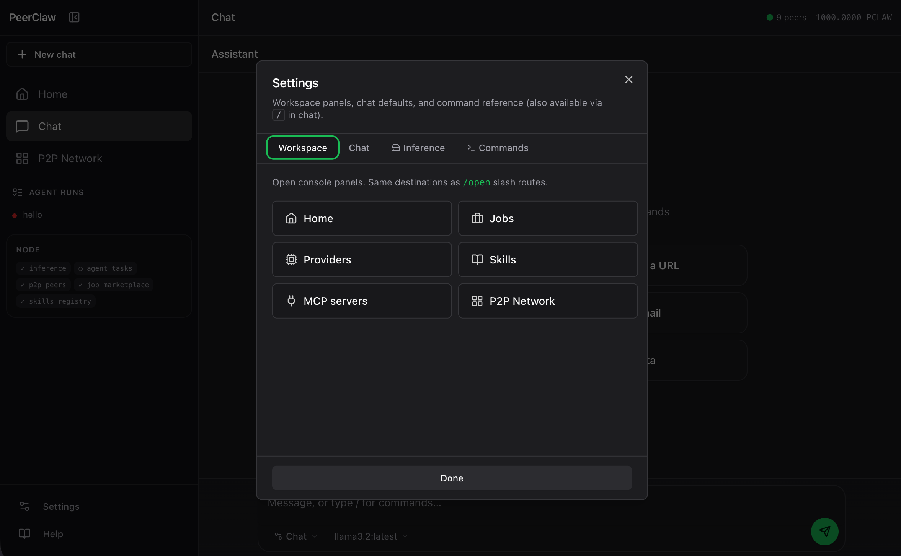
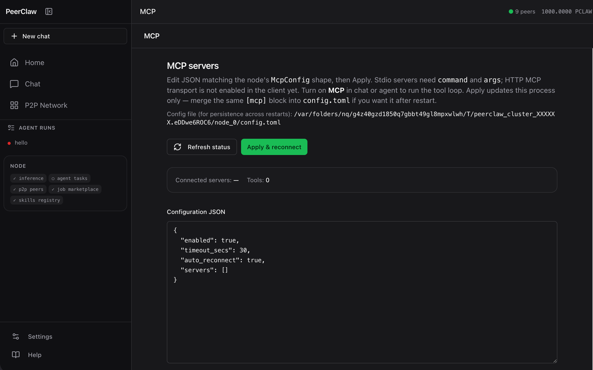
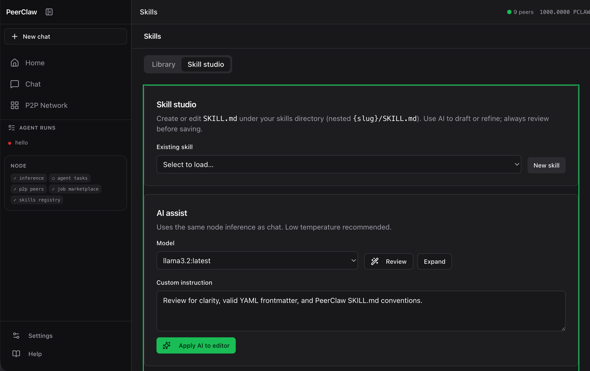

<p align="center">
  
</p>

<h1 align="center">PeerClaw</h1>

<p align="center"><strong>Decentralized P2P AI Agent Network</strong></p>

<p align="center">
  <em>One binary. Distributed intelligence. Token-powered autonomy.</em>
</p>

PeerClaw is a peer-to-peer network where AI agents collaborate, share compute resources, and transact using a native token economy. Think **BitTorrent meets AI inference** — every peer contributes compute and earns tokens, while agents spend tokens to execute tasks across the network.

**Ships as a single static binary.** No containers, no orchestrators, no cloud dependencies.

---

## Features

### AI Inference
- **Local GGUF models** — Run Llama, Phi, Qwen, Gemma locally
- **GPU acceleration** — Metal (macOS) and CUDA support via llama-cpp-2
- **Streaming output** — Real-time token generation in CLI and API
- **Batch aggregation** — Efficient multi-agent request handling
- **Model caching** — LRU eviction, automatic memory management

### Vector Memory (vectX)
- **Semantic search** — HNSW-indexed vector storage for agent memory
- **Hybrid search** — Combined vector + BM25 text search
- **Collections** — Named collections with configurable distance metrics
- **Embeddings** — Pluggable embedding providers (local or API)
- **Persistence** — In-memory or disk-backed storage

### P2P Network
- **Decentralized** — No central server, peers discover each other
- **libp2p stack** — Kademlia DHT, GossipSub, mDNS, Noise encryption
- **Job marketplace** — Request → Bid → Execute → Settle workflow; signed job messages (Ed25519)
- **Job resource types** — Inference, web fetch, WASM tool runs, CPU compute, and storage-style requests; local **web search** jobs use the same DuckDuckGo HTML path as the `web_search` tool
- **Multi-peer clusters** — Test distributed execution locally

### Token Economy
- **Native wallet** — Ed25519-based identity and transactions
- **Escrow system** — Funds locked until job completion
- **Dynamic pricing** — Each peer sets their own rates
- **Payment channels** — Efficient micro-payments between peers

### Skills System
- **SKILL.md prompts** — Markdown-based prompt extensions with YAML frontmatter
- **Activation scoring** — Automatic skill selection via keywords and patterns
- **Trust levels** — Local > Installed > Network with capability restrictions
- **P2P sharing** — Discover and install skills from other peers

### Tools & MCP
- **Builtin tools** — HTTP, web fetch, filesystem, shell, JSON/time, vector memory helpers
- **P2P job tools** — `job_submit` / `job_status` let agents place work on the marketplace (inference, web fetch, WASM, compute, storage) with PCLAW budget; wired on `peerclaw serve` to the same GossipSub path as the CLI
- **WASM sandbox** — Wasmtime-based isolation with capability grants
- **MCP integration** — Optional MCP servers (stdio); tools use `server:tool_name` ids alongside local tools
- **Custom tools** — Build and deploy WASM tools to the network

### Multi-Platform Messaging
- **Channel abstraction** — Unified interface across platforms
- **Supported platforms** — REPL, Webhook, WebSocket, Discord, Telegram, Slack, Matrix
- **User trust levels** — Unknown → Verified → Trusted → Owner
- **Conversation context** — Thread-like message history per channel

### Safety Layer
- **Leak detection** — Credential and secret pattern matching
- **Prompt injection defense** — Content sanitization and escaping
- **Policy enforcement** — Configurable content rules with severity levels
- **Input validation** — Length checks and boundary validation

### CLI Experience
- **Ollama-style commands** — `peerclaw run llama-3.2-3b`
- **Claude-Code slash commands** — `/help`, `/model`, `/settings`, `/status`
- **Interactive chat** — Conversation history, settings persistence
- **Model management** — Download, list, remove models

### OpenAI-Compatible API
- **Drop-in replacement** — Use any OpenAI SDK
- **SSE streaming** — Real-time token output via Server-Sent Events
- **`/v1/chat/completions`** — Full chat completions endpoint
- **`/v1/models`** — List available models

### Agent Runtime
- **ReAct loop** — LLM plans, calls tools, iterates until task is solved
- **Budget enforcement** — Per-request, hourly, daily, and total spend limits
- **Tool execution** — Builtin tools plus P2P marketplace hooks when running under `peerclaw serve`
- **TOML agent specs** — Define agents with model, tools, budget, and capabilities
- **Dashboard tasks** — With `--agent`, tasks go to the spec-driven runtime first; otherwise a unified tool+MCP loop runs when inference and the tool registry are available
- **Personal assistant** — Research, code, automate, monitor, summarize, analyze

### Multi-agent orchestration
- **Crews** — Define agents, tasks, and a **sequential** or **hierarchical** process; kick off runs over HTTP with optional **distributed** execution across peers (`pod_id`, `campaign_id`)
- **P2P crew task market** — Signed offers, claims, and results on `peerclaw/crew/v1`; peers can join as workers with `--crew-worker` (alongside `--share-inference` for LLM capacity)
- **Pods & campaigns** — Gossip topics for inter-pod handoffs (`peerclaw/pod/v1`) and campaign-scale aggregates (`peerclaw/world/...`) so large meshes stay sharded
- **Flows** — Declarative **FlowSpec** graphs (steps, listeners, shared state); validate and kick off via `/api/flows/*` like crews

### A2A-style HTTP surface
- **Agent Card** — `GET /.well-known/agent-card.json` describes capabilities and endpoints for integrations
- **JSON-RPC** — `POST /a2a` for task-oriented RPC aligned with Agent2Agent-style clients
- **Peer directory** — `GET /a2a/peers` lists discovered agent cards from the mesh (GossipSub-backed cache)

### Python SDK
- **Package** — `sdk/python` ships as **`peerclaw-sdk`** (`httpx`, optional YAML project loading)
- **Client** — `PeerclawClient` wraps crew validation, kickoff, run status, and streaming endpoints against `PEERCLAW_BASE_URL`

### LLM Provider Sharing
- **Share your LLM** — Let other peers use your Ollama/GGUF models for CLAW tokens
- **Rate limits** — Configure max requests/hour, tokens/day, concurrent requests
- **Auto-discovery** — Providers advertise via GossipSub, tracked network-wide
- **Pricing** — Set your own price multiplier on the base token economy rates

### Web Dashboard
- **Console home** — Quick paths to chat, node health, and scenario starters; copy highlights **crews**, **flows**, and the **Python SDK** for multi-step automation
- **Join the mesh** — Section inside **P2P Network** with live peer/swarm stats and copy-paste `serve` commands (`--share-inference`, `--crew-worker`); sidebar link removed in favor of **Crews** + in-page anchor `#join-mesh`
- **Network topology** — Interactive D3.js graph, click nodes to see details
- **Agentic chat** — Default **Tools** mode: ReAct loop over the node’s tool registry (including `job_submit` / `job_status` for network work); optional **MCP** adds external servers; plain single-shot replies when Tools is off
- **Chat API** — `POST /api/chat` and `/api/chat/stream` support `agentic`, `use_mcp`, and `session_id` for bounded server-side history
- **MCP console** — Configure MCP in the UI (`PUT /api/mcp/config`) and inspect connection status
- **Task management** — Create, monitor, and view results of agent tasks (tool traces in logs when using the unified loop)
- **Crews** — Dashboard **Crew builder** (agents, tasks, validate, kick off) plus REST + SSE (`/api/crews/*`); **flows** remain API/SDK-first (`/api/flows/*`); Agent Card + `/a2a` for external agents
- **Provider settings** — Configure LLM sharing, view discovered network providers
- **Resource monitoring** — Real-time CPU, RAM, GPU stats
- **Job tracking** — List and monitor marketplace jobs; submission is intended via chat/agents (`job_submit`), not a separate submit form
- **AI Chat interface** — Streaming assistant with workspace preferences (model, temperature, max tokens, distributed inference)

### Security
- **WASM sandbox** — Wasmtime for isolated tool execution
- **End-to-end encryption** — Noise protocol for all P2P traffic
- **Ed25519 signatures** — Cryptographic identity verification
- **Capability-based access** — Explicit permission grants

---

## Screenshots

### Chat — Unified assistant with quick-start templates

Clean composer with mode/model dropdowns, slash commands, and one-click templates for research, code review, trip planning, and more.

<p align="center">
  
</p>

### Chat — Agent settings & inference controls

The mode dropdown lets you switch between streaming chat and background agent tasks. Tools, MCP, temperature, max tokens, and distributed inference are all accessible from a single menu.

<p align="center">
  
</p>

### P2P Network — Peer topology & connections

Interactive graph of connected peers with mDNS/Kademlia status, dial-by-multiaddr, and a filterable peer list. Each node is clickable for details.

<p align="center">
  
</p>

### P2P Network — Node detail panel

Click any node in the topology to inspect its state, peer ID, task history, and success rate.

<p align="center">
  
</p>

### Settings — Inference backends

Configure Ollama, local GGUF models, and remote OpenAI-compatible APIs. Priority order: Remote API > Local GGUF > Ollama. Changes persist to `config.toml`.

<p align="center">
  
</p>

### Settings — Workspace panels

Quick navigation to console panels — Home, Jobs, Providers, Skills, MCP servers, **Crews**, **Join the mesh** (opens P2P `#join-mesh`), and P2P Network.

<p align="center">
  
</p>

### MCP — Server configuration

Edit MCP server JSON directly in the dashboard. Stdio servers need `command` and `args`. Apply to connect, then enable MCP in chat to use the tools.

<p align="center">
  
</p>

### Skills — Studio editor

Create and edit `SKILL.md` prompt extensions with AI-assisted drafting. Select a model, write instructions, and let AI review or expand your skill before saving.

<p align="center">
  
</p>

---

## Quick Start

### Install

```bash
git clone https://github.com/antonellof/peerclaw.git
cd peerclaw
cargo build --release
```

### Download a Model

```bash
mkdir -p ~/.peerclaw/models

# Llama 3.2 1B (~770MB) - fast, good for testing
curl -L -o ~/.peerclaw/models/llama-3.2-1b-instruct-q4_k_m.gguf \
  "https://huggingface.co/bartowski/Llama-3.2-1B-Instruct-GGUF/resolve/main/Llama-3.2-1B-Instruct-Q4_K_M.gguf"
```

### Run

```bash
# Interactive chat (Ollama-style)
./target/release/peerclaw run llama-3.2-1b

# Full-featured chat with slash commands
./target/release/peerclaw chat

# Start peer node with web dashboard
./target/release/peerclaw serve --web 127.0.0.1:8080

# Start with Ollama + personal assistant agent
./target/release/peerclaw serve --web 127.0.0.1:8080 --ollama --agent examples/agents/assistant.toml

# Share your LLM with the P2P network (earn CLAW tokens)
./target/release/peerclaw serve --web 127.0.0.1:8080 --ollama --share-inference --agent examples/agents/assistant.toml

# Also claim distributed crew tasks from other peers (inference-focused workers)
./target/release/peerclaw serve --web 127.0.0.1:8080 --crew-worker
```

---

## Agent Examples

### Personal Assistant

The built-in assistant agent (`examples/agents/assistant.toml`) can solve everyday tasks:

```bash
peerclaw serve --web 127.0.0.1:8080 --ollama --agent examples/agents/assistant.toml
```

Then open the dashboard at http://127.0.0.1:8080. In **Chat**, leave **Tools** on (default) for the agentic loop, enable **MCP** if you configured servers under Workspace → MCP. Use **Tasks** for longer goals. Example prompts:

| Task | What it does |
|------|-------------|
| "Research the latest Rust async patterns and summarize" | Web fetch / search tools + synthesis |
| "Fetch https://news.ycombinator.com and list the top 5 stories" | Web fetch + extract |
| "List all .rs files in the current directory" | Shell tool execution |
| "Read my Cargo.toml and explain the dependencies" | File read + analysis |
| "What time is it?" | Quick tool call |
| "Submit a small inference job to the network and poll until done" | `job_submit` + `job_status` (P2P marketplace) |

### Custom Agent Specs

Create your own agent in TOML:

```toml
# my-agent.toml
[agent]
name = "code-reviewer"
description = "Reviews code for bugs and best practices"

[model]
name = "llama3.2:3b"
max_tokens = 4096
temperature = 0.3
system_prompt = "You are an expert code reviewer. Analyze code for bugs, security issues, and suggest improvements."

[capabilities]
storage = true

[budget]
per_request = 3.0
total = 500.0

[tools]
builtin = ["file_read", "file_list", "shell"]
allowed_commands = ["grep", "wc", "find", "cat"]

[channels]
websocket = true
```

```bash
peerclaw serve --web 127.0.0.1:8080 --ollama --agent my-agent.toml
```

### Provider Sharing

Share your LLM capacity with the P2P network and earn CLAW tokens:

```bash
# Share with default limits (60 req/hr, 100k tokens/day)
peerclaw serve --ollama --share-inference

# Custom limits
peerclaw serve --ollama --share-inference --provider-max-requests 120 --provider-max-tokens-day 500000

# Full setup: web + agent + provider sharing
peerclaw serve --web 127.0.0.1:8080 --ollama --share-inference --agent examples/agents/assistant.toml
```

Other peers on the network can then use your LLM by paying CLAW tokens. Configure pricing in the **Providers** tab of the dashboard.

---

## Commands

### Chat & Inference

```bash
peerclaw run <model>              # Interactive chat
peerclaw run <model> "prompt"     # Single query
peerclaw chat                     # Chat with slash commands

# Slash commands in chat mode
/help                              # Show all commands
/model <name>                      # Switch model
/temperature <n>                   # Set temperature (0.0-2.0)
/max_tokens <n>                    # Set max output tokens
/settings                          # Settings menu
/status                            # Show runtime status
/peers                             # List connected peers
/balance                           # Show token balance
/tools                             # List available tools
/tool_exec <name> <args>           # Execute a tool
/distributed <on|off>              # Toggle distributed inference
/stream <on|off>                   # Toggle streaming output
```

### Models

```bash
peerclaw models list              # List downloaded models
peerclaw models download <model>  # Download from HuggingFace
peerclaw pull <model>             # Alias for download
```

### Network

```bash
peerclaw serve                                # Start peer node
peerclaw serve --web 0.0.0.0:8080             # With web dashboard
peerclaw serve --ollama                       # Use Ollama for inference
peerclaw serve --ollama --agent agent.toml    # With agent runtime
peerclaw serve --ollama --share-inference     # Share LLM with network
peerclaw serve --provider                     # Accept jobs from network
peerclaw peers list                           # Show connected peers
peerclaw network status                       # Network health status
```

### Vector Memory

```bash
peerclaw vector create <collection>              # Create collection
peerclaw vector list                             # List collections
peerclaw vector insert <collection> <text>       # Insert with auto-embedding
peerclaw vector search <collection> <query> -k 5 # Semantic search
peerclaw vector delete <collection>              # Delete collection
```

### Skills

```bash
peerclaw skill list               # List installed skills
peerclaw skill install <path>     # Install from file or URL
peerclaw skill info <name>        # Show skill details
peerclaw skill remove <name>      # Uninstall skill
peerclaw skill search <query>     # Search network for skills
```

### Tools

```bash
peerclaw tool list                # List available tools
peerclaw tool info <name>         # Show tool details
peerclaw tool build <path>        # Build WASM tool from source
peerclaw tool install <path>      # Install WASM tool
```

### Wallet

```bash
peerclaw wallet create            # Create new wallet
peerclaw wallet balance           # Show balance
peerclaw wallet send <addr> <amt> # Send tokens
peerclaw wallet history           # Transaction history
peerclaw wallet escrows           # Active escrows
```

### Jobs

```bash
peerclaw job submit <spec>        # Submit job to network
peerclaw job status <id>          # Check job status
peerclaw job list                 # List active jobs
peerclaw job cancel <id>          # Cancel pending job
```

### Testing

```bash
peerclaw test inference           # Test local inference
peerclaw test cluster --nodes 3   # Spawn test cluster
peerclaw test cluster --nodes 5 --keep-alive  # Keep cluster running for dashboard testing

# Or use the shell script for incremental node spin-up (visible in dashboard)
./scripts/run_agents.sh           # 5 nodes, 3s between each
./scripts/run_agents.sh 10 2      # 10 nodes, 2s delay
```

---

## OpenAI API

```bash
peerclaw serve --web 127.0.0.1:8080
```

```python
from openai import OpenAI

client = OpenAI(base_url="http://localhost:8080/v1", api_key="unused")
response = client.chat.completions.create(
    model="llama-3.2-3b",
    messages=[{"role": "user", "content": "Hello!"}],
    stream=True
)
for chunk in response:
    print(chunk.choices[0].delta.content, end="")
```

---

## Crew & flow HTTP API

With `peerclaw serve --web …`, the node exposes JSON endpoints for multi-agent runs (see `src/web/mod.rs` for the canonical list).

| Method | Path | Purpose |
|--------|------|---------|
| `POST` | `/api/crews/validate` | Validate a `CrewSpec` |
| `POST` | `/api/crews/kickoff` | Start a crew run (`inputs`, `stream`, `distributed`, `pod_id`, `campaign_id`, …) |
| `GET` | `/api/crews/runs` | List crew runs |
| `GET` | `/api/crews/runs/:id` | Run status and output |
| `GET` | `/api/crews/runs/:id/stream` | SSE progress / stream |
| `POST` | `/api/crews/runs/:id/stop` | Cooperative cancel |
| `POST` | `/api/flows/validate` | Validate a `FlowSpec` |
| `POST` | `/api/flows/kickoff` | Start a flow run |
| `GET` | `/api/flows/runs` | List flow runs |
| `GET` | `/api/flows/runs/:id` | Flow run status |

**Integrations:** `GET /.well-known/agent-card.json`, `POST /a2a`, `GET /a2a/peers`.

### Python SDK (local install)

```bash
cd sdk/python
pip install -e ".[dev]"
export PEERCLAW_BASE_URL=http://127.0.0.1:8080
python examples/minimal.py   # validates a tiny crew against a running node
```

---

## Configuration

### Environment Variables

| Variable | Description | Default |
|----------|-------------|---------|
| `PEERCLAW_HOME` | Base directory for data | `~/.peerclaw` |
| `PEERCLAW_LOG` | Log level (trace, debug, info, warn, error) | `info` |

### Config File

Create `~/.peerclaw/config.toml`:

```toml
[p2p]
listen_addresses = ["/ip4/0.0.0.0/tcp/0"]
bootstrap_peers = []
mdns_enabled = true

[web]
enabled = false
listen_addr = "127.0.0.1:8080"

[inference]
models_path = "~/.peerclaw/models"
default_model = "llama-3.2-3b"

[vector]
embedding_dim = 384
persistence_path = "~/.peerclaw/vector"

[safety]
leak_detection = true
injection_defense = true
policy_enforcement = true
```

---

## Architecture



### CLI Structure



---

## Roadmap

### v0.2 — Core Platform
- [x] P2P networking with libp2p
- [x] GGUF inference with GPU acceleration
- [x] Job marketplace protocol
- [x] Token wallet with escrow
- [x] OpenAI-compatible API
- [x] Claude-Code-style CLI
- [x] Web dashboard
- [x] Vector memory (vectX)
- [x] Skills system (SKILL.md)
- [x] Safety layer
- [x] MCP integration

### v0.3 — Production Polish
- [x] Swarm agent visualization (D3.js topology)
- [x] WASM sandbox with host bindings
- [x] Ed25519 signatures on job messages
- [x] Rustyline chat CLI
- [x] `peerclaw doctor` diagnostics

### v0.4 — Agents & Provider Sharing (Current)
- [x] Agent Runtime with ReAct loop (plan → tool call → iterate)
- [x] LLM Provider Sharing protocol (share Ollama/GGUF over P2P)
- [x] Remote execution wired (RemoteExecutor → P2P job flow)
- [x] Interactive dashboard: Tasks, Providers, clickable topology nodes
- [x] Budget enforcement (per-request/hour/day/total)
- [x] Task management API
- [x] Example agents (assistant, coder, researcher, monitor, data-analyst)
- [x] Web agentic chat: unified ReAct path (local tools + optional MCP + long-horizon tool iterations)
- [x] P2P `job_submit` / `job_status` tools connected to the serve node (GossipSub + `JobManager`)
- [x] Marketplace job types: inference, web_fetch, wasm, compute, storage (web + tool path)
- [x] **Crews** — `CrewSpec`, sequential/hierarchical orchestration, REST + SSE, optional distributed runs
- [x] **Flows** — `FlowSpec` interpreter and `/api/flows/*`
- [x] **P2P orchestration** — Crew task market, pod/world gossip topics, `--crew-worker`
- [x] **A2A-shaped HTTP** — Agent Card, JSON-RPC `/a2a`, peer card cache
- [x] **Python SDK** — `peerclaw-sdk` in `sdk/python` (validate, kickoff, runs)
- [x] **Join network** landing in the web dashboard

### Next (v0.5)
- [ ] Distributed inference (pipeline parallelism)
- [x] Multi-agent collaboration (crews, flows, P2P crew market — **in progress**: hardening, docs, CI; see repo plan)
- [ ] Durable agent runs (checkpoints, resume after restart) and richer observability
- [ ] Cross-peer tool execution (discovery, quotes, escrow) and marketplace reputation
- [ ] Human-in-the-loop approvals for high-risk tools
- [ ] Context compaction for long conversations

### Future (v1.0)
- [ ] On-chain settlement
- [ ] Public tool registry
- [ ] Governance
- [ ] Firecracker microVM isolation (and stronger “computer use” sandboxes)

---

*Crate v0.3.0 — March 2026 (feature set above includes v0.4 orchestration items in-tree)*
