# Architecture

## Single Binary Design

PeerClaw ships as a single statically-linked binary that operates in multiple modes. Every peer runs the same binary — roles (resource provider, agent host, gateway) are determined at runtime.

## Internal Architecture

## Core Modules

### Node (`src/node.rs`)
Central coordinator that orchestrates all subsystems: P2P network, database, identity, inference, and graceful shutdown.

### Task Executor (`src/executor/`)
Smart routing of tasks between local and remote execution:
- **Router** (`router.rs`) — Automatic local vs network routing based on resources
- **Resource Monitor** (`resource.rs`) — CPU, RAM, GPU, model availability tracking
- **Remote Execution** (`remote.rs`) — P2P job delegation
- Local inference with GPU offloading
- Web fetch with rate limiting
- WASM tool execution

### Inference Engine (`src/inference/`)
GGUF model loading and inference:
- **GGUF Backend** (`gguf.rs`) — `llama-cpp-2` for real inference
- **Model Cache** (`cache.rs`) — LRU caching with memory management
- **Batch Processing** (`batch.rs`) — Request aggregation for efficiency
- **Model Distribution** (`distribution.rs`) — P2P model file distribution
- **Model Registry** (`model.rs`) — ModelInfo, quantization tracking

### Vector Store (`src/vector/`)
vectX-based semantic memory:
- **HNSW Indexing** — Fast approximate nearest neighbor search
- **BM25 Text Search** — Keyword-based retrieval
- **Hybrid Search** — Combined vector + text ranking
- **Collections** — Named collections with distance metrics (Cosine, Euclidean, DotProduct)
- **Embeddings** (`embeddings.rs`) — Pluggable embedding providers
- **Persistence** — In-memory or disk-backed storage

### Job Manager (`src/job/`)
P2P job marketplace:
- **Job Requests** (`request.rs`) — Requirements (CPU, RAM, GPU, models)
- **Bidding** (`bid.rs`) — Peer pricing, bid selection
- **Execution** (`execution.rs`) — Status tracking, metrics
- **Pricing** (`pricing.rs`) — ResourceType pricing, PricingStrategy
- **Network** (`network.rs`) — JobMessage types for P2P protocol

### P2P Network (`src/p2p/`)
libp2p-based networking:
- **Behaviour** (`behaviour.rs`) — Kademlia DHT, mDNS, GossipSub, Request-Response
- **Events** (`events.rs`) — Network event types
- **Resource Advertisement** (`resource.rs`) — Capability/resource manifests
- Noise encryption for all traffic
- QUIC + TCP transports

### Wallet (`src/wallet/`)
PCLAW token accounting:
- **Balance** (`balance.rs`) — Available, in-escrow, staked amounts
- **Escrow** (`escrow.rs`) — EscrowId, EscrowStatus for job settlement
- **Transactions** (`transaction.rs`) — TransactionId, TransactionType
- Spending controls (per-tx, per-hour, per-day limits)
- Database-backed persistent state

### Tools (`src/tools/`)
Extensible tool system:
- **Registry** (`registry.rs`) — Tool discovery and management
- **Tool Trait** (`tool.rs`) — ToolContext, ToolOutput, ToolError
- **Builtin Tools** (`builtin/`):
  - `core.rs` — echo, time, json
  - `http.rs` — HTTP requests, web_fetch
  - `file.rs` — file_read, file_write, file_list
  - `shell.rs` — Shell command execution
  - `memory.rs` — Vector DB integration (memory search/write)
  - `p2p.rs` — job_submit, job_status, peer_discovery, wallet_balance
- **Capabilities** — HTTP allowlist, file access, secret injection, execution limits

### WASM Sandbox (`src/wasm/`)
Wasmtime-based tool isolation:
- **Sandbox** (`sandbox.rs`) — CompiledModule, WasmSandbox with fuel metering
- **Fuel Metering** (`fuel.rs`) — FuelConfig, FuelMeter for resource limits
- **Host Functions** (`host.rs`) — HostCapabilities, HostState
- **Tool Hash** — BLAKE3-based tool identification
- Capability-based isolation, memory limiting, timeout enforcement

### MCP Client (`src/mcp/`)
Model Context Protocol integration:
- **Client** (`client.rs`) — MCP protocol client
- **Types** (`types.rs`) — McpTool, McpResource, McpToolResult
- **Manager** — Multiple server management
- Tool listing, tool calling, resource reading, auto-reconnect

### Skills (`src/skills/`)
SKILL.md prompt extension system:
- **Parser** (`parser.rs`) — YAML frontmatter + markdown parsing
- **Registry** (`registry.rs`) — LoadedSkill management
- **Selector** (`selector.rs`) — Activation scoring, keyword matching
- **Trust Model**: Local (full tool access) > Installed (read-only) > Network (minimal)
- **Activation Criteria**: keywords, exclude_keywords, patterns, tags
- **P2P Sharing**: SkillAnnouncement with price, provider, hash

### Safety (`src/safety/`)
Defense-in-depth security:
- **Leak Detection** (`leak_detector.rs`) — Credential pattern matching
- **Sanitizer** (`sanitizer.rs`) — Prompt injection defense, content escaping
- **Policy** (`policy.rs`) — Content policy rules with severity levels
- **Validator** (`validator.rs`) — Input validation and length checks
- Configurable redaction strings for detected secrets

### Messaging (`src/messaging/`)
Multi-platform messaging:
- **Channel Types**: REPL, Webhook, WebSocket, Telegram, Discord, Slack, Matrix, P2P, WASM
- **Registry** (`registry.rs`) — ChannelHandle management
- **Platforms** (`platforms/`):
  - `repl.rs` — CLI input/output
  - `p2p.rs` — Peer-to-peer messaging
  - `webhook.rs` — HTTP webhook endpoints
- **User Trust**: Unknown → Verified → Trusted → Owner
- **Conversation**: Thread-like context with message history

### Routines (`src/routines/`)
Background automation:
- **Cron Scheduler** (`cron.rs`) — cron-based scheduling
- **Heartbeat** (`heartbeat.rs`) — Periodic proactive execution
- **Trigger Types**: Cron, Interval, Event, Webhook, Startup, Manual
- **Actions**: Prompt, Tool, Command, ReadFile, Custom

### Web (`src/web/`)
Web interface and API:
- **OpenAI Compatible** (`openai.rs`) — `/v1/chat/completions`, `/v1/models`
- **Dashboard** — Network topology, resource monitoring, job tracking
- **SSE Streaming** — Real-time updates

## Technology Stack

| Subsystem | Crate |
|-----------|-------|
| Async Runtime | `tokio` |
| P2P Networking | `libp2p` 0.54 |
| Vector Database | `vectx` |
| WASM Sandbox | `wasmtime` 28.x |
| HTTP/Web | `axum` 0.7 |
| Database | `redb` 2.x |
| Serialization | `serde` + `rmp-serde` (MessagePack) |
| Crypto | `ed25519-dalek` 2.x, `blake3` |
| AI Inference | `llama-cpp-2` 0.1 |
| CLI | `clap` 4.x |
| Logging | `tracing` |
| Config | `figment` |

## Data Flow

---

*v0.2 — March 2026*
