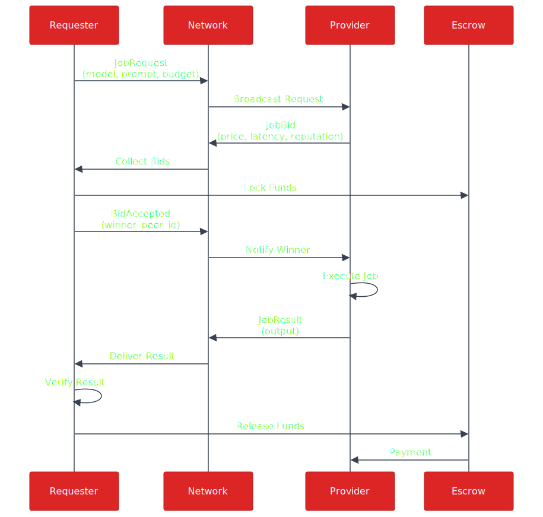

# P2P Network Protocol

## Transport Stack



## Peer Discovery

- **Local network**: mDNS for zero-config LAN discovery
- **Wide area**: Kademlia DHT with bootstrap peers
- **NAT traversal**: QUIC with hole-punching

## GossipSub Topics

| Topic | Purpose |
|-------|---------|
| `peerclaw/jobs/requests` | Job request broadcasts |
| `peerclaw/jobs/bids` | Bid announcements |
| `peerclaw/jobs/status` | Job status updates, results |
| `peerclaw/models/announce` | Model availability |

## Job Protocol



## Message Format

All messages are MessagePack-encoded with this wrapper:

```rust
struct NetworkMessage {
    message_type: String,
    payload: Vec<u8>,
    timestamp: u64,
    signature: Vec<u8>,
}
```
