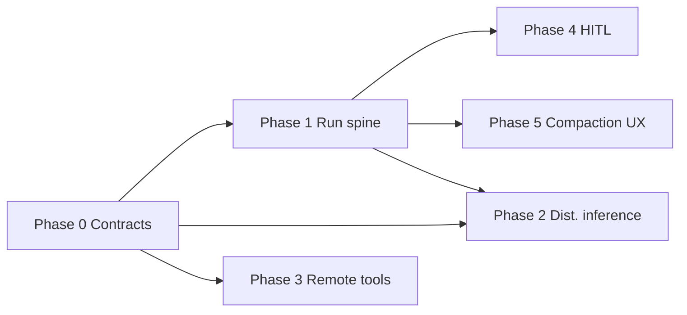

# PeerClaw v0.5 — Engineering plan (living document)

This document **extends** the roadmap summary in the root [README.md](../README.md). Update it as scopes change; use it to open issues and track acceptance criteria.

**Baseline:** v0.4 in-tree — crews, flows, P2P crew market, provider sharing, agentic web path, externalized `prompts/*.txt`, job marketplace, wallet/escrow.

**Release intent for v0.5:** Production-grade multi-agent operations, **durable** and **observable** runs, first **cross-peer tool** economics, **HITL** for risky actions, **productized** context management, and a **credible path** to multi-node inference (even if initially feature-flagged).

---

## 1. Dependency overview

Phases **0** is a prerequisite for stable parallel work. **1** (run spine) unlocks **4** (HITL audit) and **5** (compaction metrics). **2** (distributed inference) and **3** (remote tools) can start after **0** with separate owners; both should reuse **economy** and **P2P** patterns from `src/job/` and `src/p2p/`.

---

## 2. Code map (where to plug in)

| Area | Primary locations | Notes |
|------|-------------------|--------|
| Agentic loop | `src/agent/unified_loop.rs`, `src/agent/runtime.rs` | Tool calls, passes, cancellation |
| Context compaction | `src/agent/compaction.rs` | `prune_conversation`, `prune_string_conversation`, LLM summary hook |
| Web tasks / chat | `src/web/mod.rs` | `/api/tasks`, `/api/chat`, SSE |
| Crews | `src/crew/spec.rs`, `orchestrator.rs`, `store.rs`, `p2p.rs` | In-memory `CrewRunStore` today |
| Flows | `src/flow/mod.rs` | In-memory `FlowRunStore` |
| Jobs / economy | `src/job/`, `src/wallet/` | Escrow, bids, execution phases |
| P2P | `src/p2p/` | GossipSub topics, behaviour |
| Provider sharing | `src/inference/`, provider tracker in `src/runtime.rs` | Remote single-shot inference path |
| Prompts | `src/prompts/`, `prompts/*.txt` | Runtime overlay |
| Persistence | `src/db/` | Extend for run events / checkpoints |
| Doctor | `src/cli/doctor.rs` (or equivalent) | New subsystem checks |

---

## 3. Phase 0 — API contracts & golden fixtures

**Goal:** Stable JSON contracts for integrators; regression tests that fail on accidental breaking changes.

### Work packages

| ID | Task | Acceptance criteria |
|----|------|---------------------|
| V05-0-01 | **Fixture matrix** | `templates/crews/minimal.json`, `kickoff-minimal.json`, `templates/flows/minimal.json` (+ future “stress” specs); documented in README; `tests/examples_contract.rs` locks parsing |
| V05-0-02 | **Contract tests** | `cargo test` parses fixtures against `CrewSpec::validate`, `FlowSpec::validate` + `execution_order()` |
| V05-0-03 | **HTTP shape doc** | Table of `/api/*` bodies: which endpoints expect raw spec vs wrapped body (crews validate vs kickoff); align README with `src/web/mod.rs` |
| V05-0-04 | **Error JSON** | Standardize error responses for validate/kickoff/stop (e.g. `{ "ok": false, "error": "..." }` vs Axum errors); document |
| V05-0-05 | **Idempotency notes** | Document: kickoff always new `run_id`; stop is best-effort cooperative cancel |

### Multi-agent hardening (starts in Phase 0, continues through v0.5)

| ID | Task | Acceptance criteria |
|----|------|---------------------|
| V05-0-10 | **Failure injection** | Tests: crew agent missing, invalid task graph, flow cycle, kickoff when queue full |
| V05-0-11 | **SDK parity** | `sdk/python` examples cover validate + kickoff + poll run (align with `templates/crews/kickoff-minimal.json`) |
| V05-0-12 | **CI** | Workflow runs `cargo test`, `clippy`, optional `npm test` for `web/` on PR |

---

## 4. Phase 1 — Run spine: observability + durability foundation

**Problem today:** `CrewRunStore` / `FlowRunStore` are in-memory; web task state is partially in `WebTask` + logs. Restart loses history; no unified event stream for tooling.

### 4.1 Unified run model (design)

Define a generic **`RunRecord`** (or per-kind tables with shared envelope):

- `run_id`, `kind` (`agent_task` | `crew` | `flow`), `status`, `created_at`, `updated_at`
- `spec_fingerprint` (hash of canonical JSON), `inputs_redacted` (no secrets)
- `events: Vec<RunEvent>` append-only

**`RunEvent` examples:** `pass_started`, `pass_completed`, `tool_started`, `tool_completed`, `inference_completed`, `error`, `cancelled`, `checkpoint_saved`

### Work packages

| ID | Task | Acceptance criteria |
|----|------|---------------------|
| V05-1-01 | **Schema + migration** | redb tables (or extend `src/db/`) for runs + events; migration from “no data” |
| V05-1-02 | **Instrumentation** | Emit events from crew orchestrator, flow runner, unified loop (behind config flag if needed) |
| V05-1-03 | **GET APIs** | `GET /api/runs`, `GET /api/runs/:id`, `GET /api/runs/:id/events` (or nest under existing tasks/crews/flows with aliases) |
| V05-1-04 | **Console** | Minimal UI: run timeline for last N runs (reuse WS control plane if cheap) |
| V05-1-05 | **Checkpoint v0** | Serialize “resumable” state for **one** path (e.g. web `WebTask` + session id); **resume** after restart documented and tested |

### Observability extras

| ID | Task | Acceptance criteria |
|----|------|---------------------|
| V05-1-10 | **Tracing spans** | `tracing` spans for `react_pass`, `tool_execute`, `crew_task`, `job_phase` with `run_id` field |
| V05-1-11 | **OTLP (optional)** | Feature flag `telemetry.otlp_endpoint`; document env vars |

---

## 5. Phase 2 — Distributed inference

**Non-goal for v0.5.0:** Full tensor parallelism at datacenter scale.

**Goal:** A **documented protocol** and a **working 2-peer** path (e.g. pipeline: peer A runs layers 0..k, peer B runs k..end) behind `config.inference.distributed_pipeline` or similar, with timeout + fallback to local single-peer inference.

### Work packages

| ID | Task | Acceptance criteria |
|----|------|---------------------|
| V05-2-01 | **Protocol doc** | New `docs/DISTRIBUTED_INFERENCE.md`: message types, caps, failure modes |
| V05-2-02 | **Gossip or R-R** | Choose transport (likely request-response + small GossipSub advert); align with existing provider ads |
| V05-2-03 | **Metering** | Charge PCLAW per sub-request; integrate with `Wallet` / economy config |
| V05-2-04 | **Doctor** | `peerclaw doctor` reports pipeline capability and last handshake error |
| V05-2-05 | **Security** | Same Noise + Ed25519 as jobs; size limits on intermediate payloads |

---

## 6. Phase 3 — Cross-peer tool execution & reputation

**Goal:** Peers advertise **executable tool manifests** (name, schema, price, attestation hash); requester gets quote → escrow → execute → settle; **reputation** = rolling success rate from signed receipts (off-chain v0.5).

### Work packages

| ID | Task | Acceptance criteria |
|----|------|---------------------|
| V05-3-01 | **Manifest type** | Rust struct + serde JSON; version field |
| V05-3-02 | **Discovery** | DHT or GossipSub topic `peerclaw/tools/v1` (name TBD) listing manifests |
| V05-3-03 | **Job integration** | New `ResourceType` or parallel “tool job” flow reusing `JobManager` patterns |
| V05-3-04 | **Receipts** | Signed completion record; peer stores aggregates in `redb` |
| V05-3-05 | **Local tool** | `remote_tool_call` or extend `job_submit` story in docs + one E2E test in test cluster |

---

## 7. Phase 4 — Human-in-the-loop (HITL)

**Goal:** When policy says “high risk”, tool execution **blocks** until approved via API (and UI), with timeout and audit entry on Phase 1 spine.

### Policy sources (v0.5)

- Tool name patterns (e.g. `shell`, `file_write`)
- Agent spec TOML: `[hitl] tools = ["shell"]` or spend threshold
- Global `config.toml` defaults

### Work packages

| ID | Task | Acceptance criteria |
|----|------|---------------------|
| V05-4-01 | **State machine** | `pending_approval` → `approved` \| `rejected` \| `expired` |
| V05-4-02 | **API** | `GET /api/approvals`, `POST /api/approvals/:id/approve`, `…/reject` |
| V05-4-03 | **Wire unified loop** | Block `ToolRegistry::execute_local` path when approval missing |
| V05-4-04 | **Web UI** | Queue panel + reason + tool args preview (redacted) |
| V05-4-05 | **Tests** | Timeout path releases lock; no double-execution |

---

## 8. Phase 5 — Context compaction (productized)

**Today:** `compaction.rs` implements truncation + optional LLM summary path; unified loop uses string pruning.

**Goal:** One **user-visible** policy: max context tokens/chars, strategy (`truncate` | `summarize` | `hybrid`), per-surface (chat, tasks, agent).

### Work packages

| ID | Task | Acceptance criteria |
|----|------|---------------------|
| V05-5-01 | **Config** | `[agent.compaction]` or nested under `inference` / `web`; env override |
| V05-5-02 | **Unified loop** | Call summary compaction when over budget (optional extra inference call) |
| V05-5-03 | **Web** | Chat/settings: show approximate context fill; warn near limit |
| V05-5-04 | **Tests** | Property: conversation length bounded after N turns; golden transcripts |

---

## 9. Risks & mitigations

| Risk | Mitigation |
|------|------------|
| Scope creep on distributed inference | Ship protocol + 2-peer demo behind flag; defer wide acceleration |
| redb migration pain | Version tables; optional “export JSON” before upgrade |
| HITL deadlocks | Always-on timeout; executor thread pool isolation |
| OTLP noise | Default off; sample rate config |

---

## 10. Suggested issue titles (copy-paste)

1. `[v0.5] Phase 0: JSON contract tests for crew/flow examples`
2. `[v0.5] Phase 1: Persist run events to redb + GET /api/runs`
3. `[v0.5] Phase 1: Tracing spans for unified_loop tool calls`
4. `[v0.5] Phase 2: DESIGN ONLY — distributed inference message format`
5. `[v0.5] Phase 3: Tool manifest advertisement on GossipSub`
6. `[v0.5] Phase 4: HITL approval API + shell tool gate`
7. `[v0.5] Phase 5: Compaction policy in config + unified loop`

---

## 11. Revision history

| Date | Change |
|------|--------|
| 2026-03-28 | Initial expanded plan from README roadmap |

---

*Maintainers: keep README checklist in sync when a phase’s acceptance criteria are met (check boxes or move to “Done in v0.5.x”).*
